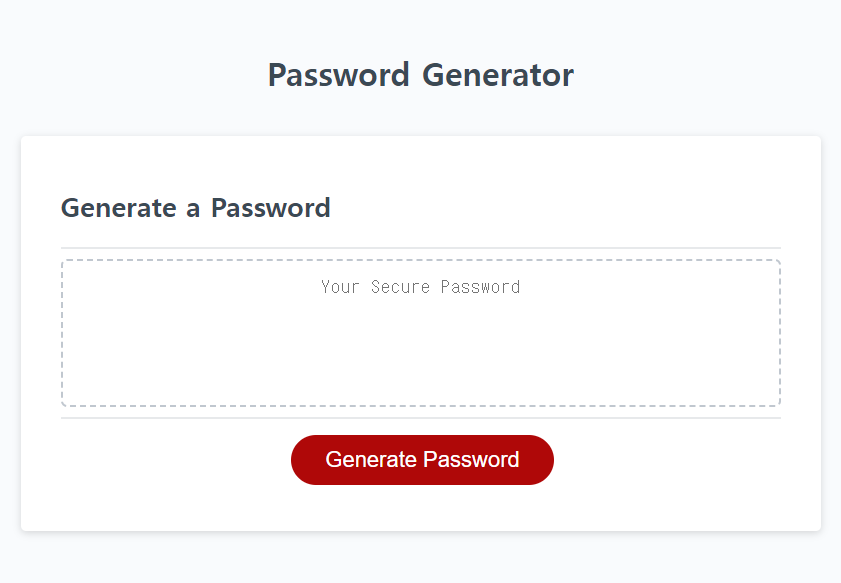

# Random Password Generator

## Description

This website generates randomized password for safety. Users can choose from 8 to 128 characters, to have lower case letter, 
to have upper case letter, to have numbers, or to have special characters in their password. When entered into website, user is promt to enter 
password length between 8 to 128. If the user inputs invalid number or cancels, then the generator is canceled until 'Generate Password' is pressed.
Then user is given a choice from upper case, lower case, number, or special character in their password. If none is chosen, then user will get an alert. Once user have meet the criteria to generate password, then user will get an randomized password in the text box.

## Screenshot
;

## Tech Used

## License

N/A

## Contact

<ul>
    <li><b>Email: </b> <a href="connorcho22@gmail.com">connorcho22@gmail.com</a></li>
    <li><b>Github: </b> <a href="https://github.com/connorcho66">connorcho66</a></li>
    <li><b>Linked In: </b> <a href="www.linkedin.com/in/seongyun-cho-89a8a61a0">SeongYun Cho</a></li>
</ul>